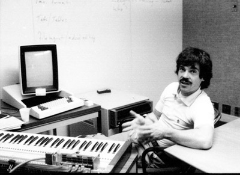

## {{ page.title }}

STEM实际上是四个不同的领域，但是相辅相成。

# Science 

S是科学, 主要强调科学方法，思维和概念。 其核心是实验，观察和证伪。 现在伪科学在国内和国外都很流行。 大家都有目共睹.

# Technology
T是技术，就是人类创造的工具和系统，增强人类作为一个集体和自然交互的能力。
比如我们现在能隔着半个地球，时差12小时，通过不同的电子终端交流讨论，就是人类技术的奇迹。

# Engineering 
E是工程。是人类集体合作解决问题的系统方法和实践。 盖房子是工程，登月是工程，互联网是工程。
现代工程的发展的确是人类集体合作的一个奇迹。

# Math

M是数学。 也就是抽象思维和逻辑。 这是所有工程技术科学发展的真实核心。 数学保证了人类知识的可靠性和延续发展性。 改变了人类看世界的角度。 我们比牛顿之前的人没有聪明多少，但是微积分让我们每一个人都比牛顿前的人智商都高，这就是视角的重要性。

一位著名的学者（Alan Kay) 有一句名言：好的视角可以增加80个IQ。

- Alan Kay的远见 [A personal Computer for Children of All Ages](Kay72a.pdf) (PDF)

- 41年以后的现实 [Afterword: What is a Dynabook?](hc_what_Is_a_dynabook.pdf) (PDF) 

# STEM

所以STEM教育的核心不是知识积累，而是思维方式和工作方式的训练。
这不是抽象的教育，而是人类近代百年来进步的总结。
