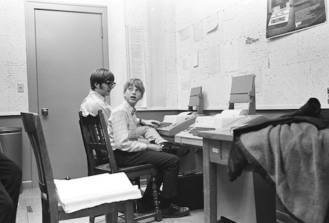
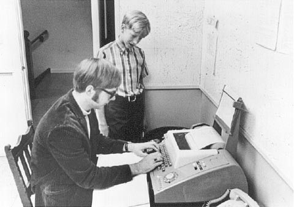
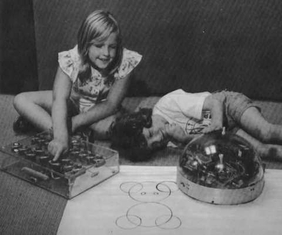
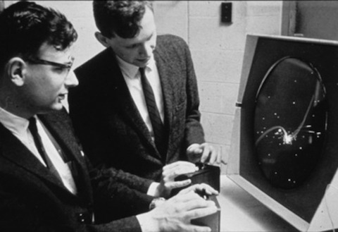

## {{ page.title }}

首先我在這裡想聲明的是我們要討論的「貴族」不是從產品市場的觀點，而是從「優越的社會環境」的角度來看的。否則STEM教育和富二代的「蘭博基尼」不是一個量級的問題。

我這裡舉幾個我認為的「貴族弟子」的例子 (按時間倒序排列)。

這是微軟創始人的七十年代的私立高中的電腦機房。關於他們的故事網上可以找到。

這是Seymour Papert的LOGO教育實驗室的孩子。他們用的電腦當時就價值百萬美元。

這是六十年代的第一個電子遊戲，叫做Spacewar!，是在示波器上玩的。

這就是我個人心目中的「貴族學校」。其主要特點就是**用其他人沒有的資源學習和探索其他人做不了的事情**。

所以我的觀點是：

- 如果大家把「貴族」當成「消費者」，我們的目標就是「產品」。

- 如果把「貴族」當成「創造者」和「領路人」，我們的目標就是給他們提供「環境」。

如果分清了「產品」和「環境」的差別，教師的作用也就很明確了。

- 如果是「產品」，教師就是「工人」，教材和教程就是他們「生產成果」。

- 如果是「環境」，教師就是「園丁」，「澆水，施肥，除草」就是他們的「工作」。

從這一點看，「教師缺乏」這個問題其實不是我們缺少「既會編程，又會教書，還會寫教材」的高級人才。雖然這樣的人才交集的確很少。

從「園丁」的角度看，我們缺少的是能真正理解技術，真正理解學生（大家都是12-18歲青春期的過來人，雖然我是三十年前，八零後是十幾年前，應該還記憶猶新）和真正理解學習方法的人才。在現代環境下，技術工具平台很容易流行，也很容易過時。STEM和創客教育需要資源和技術支持，需要商業市場支持。

但是歸根結底，學用鉛筆和學會用文字交流是不同的目的，有不同的挑戰。需要各方合作共同努力才能解決這個難題。

從計算機技術發展史的角度看，[這篇文章](elite.pdf)裡面提到的人都屬於上個世紀的「貴族」, 我們這個世紀的「貴族」將會在哪裡呢？
